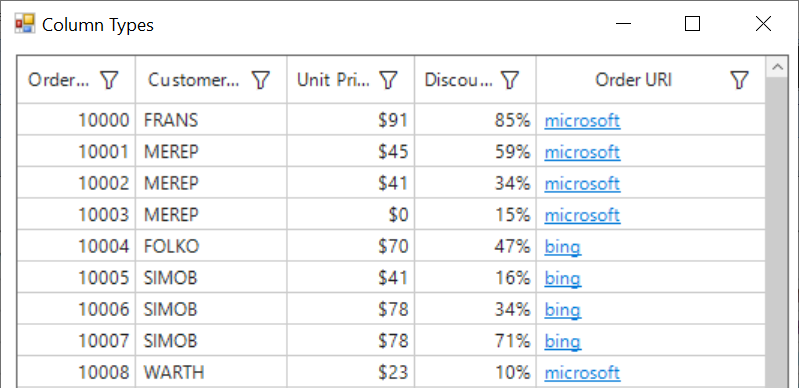

# how-to-modify-the-gridhyperlinkcolumn-text-in-winforms-datagrid
How to modify the GridHyperLinkColumn text in WinForms DataGrid (SfDataGrid)?

By default, the text in GridHypelinkColumn will be updated with provided link. To change the text of hyperlink in the cells, the DisplayText can be changed based on our requirement using SfDataGrid.DrawCell event.

```C#
//Event subscription
this.sfDataGrid1.DrawCell += SfDataGrid1_DrawCell;

//Event customization
private void SfDataGrid1_DrawCell(object sender, DrawCellEventArgs e)
{
    if(e.Column.MappingName == "Hyperlink")
    {
        string displayText = e.DisplayText;
        int index = displayText.LastIndexOf('.');
        int firstIndex = displayText.IndexOf('.');
        int length = displayText.Length - (displayText.Length - index) - firstIndex;
        displayText = e.DisplayText.Substring(firstIndex + 1, length - 1);

        //To update text of hyperlink.
        e.DisplayText = displayText;
    }
}
```

