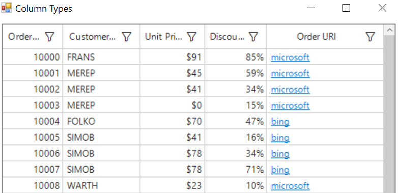

# How to modify the GridHyperLinkColumn text in WinForms DataGrid?


By default In [WinForms DataGrid](https://www.syncfusion.com/winforms-ui-controls/datagrid) (SfDataGrid), the text in [GridHyperLinkColumn](https://help.syncfusion.com/cr/windowsforms/Syncfusion.WinForms.DataGrid.GridHyperlinkColumn.html) will be updated with provided link. To change the text of hyperlink in the cells, the DisplayText can be changed based on our requirement using [DrawCell](https://help.syncfusion.com/cr/windowsforms/Syncfusion.WinForms.DataGrid.SfDataGrid.html#Syncfusion_WinForms_DataGrid_SfDataGrid_DrawCell) event.

```csharp
//Event subscription
this.sfDataGrid1.DrawCell += SfDataGrid1_DrawCell;
 
//Event customization
private void SfDataGrid1_DrawCell(object sender, DrawCellEventArgs e)
{
    if(e.Column.MappingName == "Hyperlink")
    {
        string displayText = e.DisplayText;
        int index = displayText.LastIndexOf('.');
        int firstIndex = displayText.IndexOf('.');
        int length = displayText.Length - (displayText.Length - index) - firstIndex;
        displayText = e.DisplayText.Substring(firstIndex + 1, length - 1);
 
        //To update text of hyperlink.
        e.DisplayText = displayText;
    }
}
```

